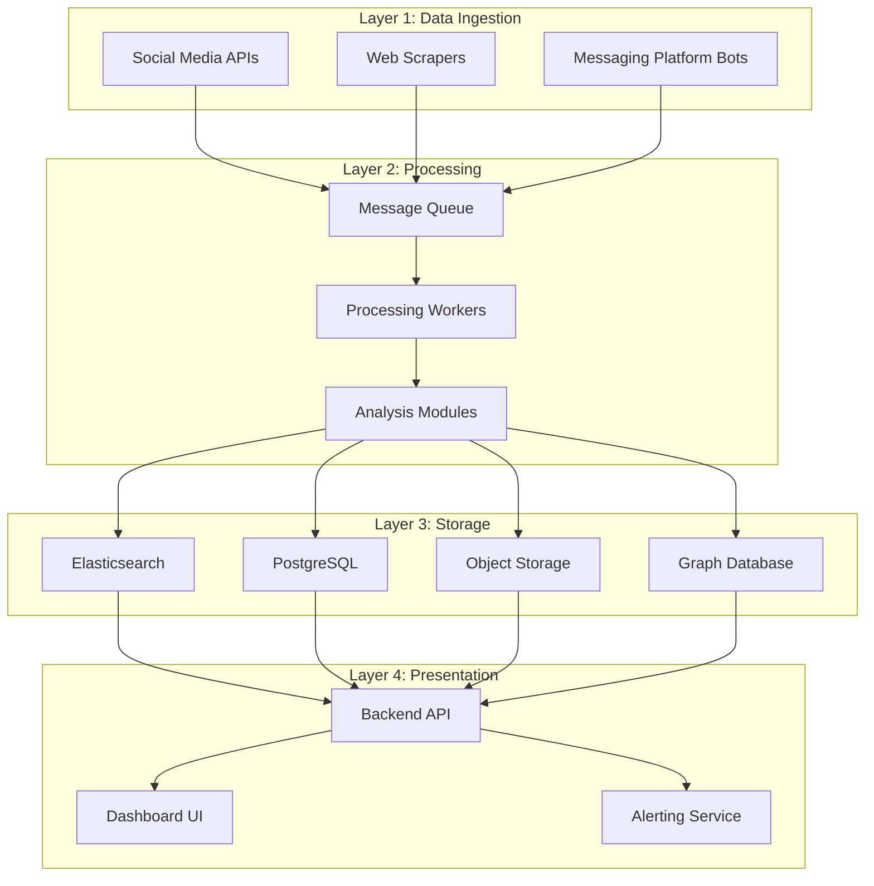

# Design Document

## Overview

The Aegis VIP Threat & Misinformation Monitoring Platform is designed as a microservices-based real-time intelligence system. The architecture follows a four-layer approach: Data Ingestion (Collectors), Data Processing & Analysis (Brain), Data Storage (Memory), and Presentation & Alerting (Dashboard). This modular design ensures scalability, resilience, and the ability to add new data sources or detection modules without disrupting existing workflows.

## Architecture

### High-Level Architecture



### Data Flow Architecture

1. **Ingestion Layer**: Independent collectors gather data from various sources
2. **Message Queue**: Decouples ingestion from processing, handles backpressure
3. **Processing Workers**: Consume messages and apply analysis modules
4. **Storage Layer**: Persists processed data and evidence
5. **API Layer**: Serves data to frontend and external systems
6. **Presentation Layer**: Dashboard and alerting interfaces

## Components and Interfaces

### Data Ingestion Components

#### Social Media API Connectors
- **Twitter/X Connector**: Uses Twitter API v2 for real-time streaming and search
- **Meta Graph API Connector**: Monitors Facebook and Instagram mentions
- **LinkedIn API Connector**: Tracks professional network mentions
- **Interface**: Standardized JSON output `{source, author, content, url, timestamp, media_urls}`

#### Web Scrapers
- **Primary**: **Scrapy** (easiest Python framework for web scraping)
- **Simple Tasks**: **Requests + BeautifulSoup** for basic scraping needs
- **Monitoring**: **Huginn** for automated website monitoring (optional)
- **Rate Limiting**: Built-in Scrapy middleware for respectful crawling

#### Messaging Platform Bots
- **Telegram Bot**: Monitors public channels using Bot API
- **Discord Bot**: Tracks public servers using Discord API
- **Authentication**: Secure token management and API key rotation

### Processing Components

#### Message Queue System
- **Technology**: **RabbitMQ** (recommended for easiest setup and reliable delivery)
- **Alternative**: Redis with pub/sub for simpler scenarios
- **Topics**: Separate queues for different data sources and priority levels
- **Scaling**: Simple horizontal scaling with multiple workers

#### Analysis Modules

##### NLP Threat Detection Module
- **Technology**: Hugging Face Transformers with pre-trained models
- **spaCy**: Fast NLP processing for named entity recognition
- **Capabilities**: Sentiment analysis, threat classification, toxicity scoring
- **Thresholds**: Configurable severity levels for different threat types

##### Image Analysis Module
- **ImageHash**: Python library for perceptual hashing (pHash) image comparison
- **PyTorch/TensorFlow**: Deep learning frameworks for deepfake detection
- **Reverse Image Search**: Integrates with Google Lens API
- **Models**: Open-source implementations from FaceForensics++ research

##### Impersonation Detection Module
- **Username Analysis**: Levenshtein distance calculation
- **Profile Scoring**: Weighted algorithm considering multiple factors
- **Golden Records**: Maintains verified VIP profile database

##### Coordinated Behavior Module
- **NetworkX**: Python library for graph creation and analysis
- **Content Similarity**: Jaccard similarity on n-grams
- **Temporal Analysis**: Statistical anomaly detection
- **Network Analysis**: Community detection using Louvain algorithm

### Storage Components

#### Search and Analytics
- **Technology**: **Elasticsearch** (easiest setup with Docker)
- **Alternative**: **PostgreSQL with full-text search** for simpler deployments
- **Purpose**: Full-text search and real-time analytics
- **Setup**: Single-node for development, cluster for production

#### PostgreSQL Database
- **Schema**: Relational data for VIP profiles, user accounts, system configuration
- **Tables**: vips, incidents, users, analysis_results, campaigns
- **Indexing**: Optimized for dashboard queries and reporting

#### Object Storage
- **Technology**: **Local filesystem** for development, **MinIO** for production
- **Alternative**: **AWS S3** for cloud deployments
- **Structure**: Organized by incident ID and content type
- **Retention**: Simple file-based cleanup scripts

#### Graph Database (Optional)
- **Technology**: **NetworkX + JSON storage** for simple graphs
- **Advanced**: **Neo4j Community Edition** for complex network analysis
- **Purpose**: Network analysis and campaign visualization
- **Start Simple**: Store relationships in PostgreSQL, upgrade later

## Data Models

### Core Data Models

#### Incident Model
```json
{
  "id": "uuid",
  "vip_id": "uuid",
  "platform": "string",
  "severity": "enum[low,medium,high,critical]",
  "threat_type": "enum[impersonation,misinformation,threat,leak]",
  "content": "text",
  "source_url": "string",
  "detected_at": "timestamp",
  "status": "enum[new,reviewing,resolved,false_positive]",
  "evidence": {
    "screenshot_url": "string",
    "media_urls": ["string"],
    "metadata": "object"
  },
  "analysis_results": "object"
}
```

#### VIP Profile Model
```json
{
  "id": "uuid",
  "name": "string",
  "official_profiles": {
    "twitter": "string",
    "facebook": "string",
    "instagram": "string",
    "linkedin": "string"
  },
  "keywords": ["string"],
  "monitoring_active": "boolean",
  "alert_settings": "object"
}
```

#### Campaign Model
```json
{
  "id": "uuid",
  "vip_id": "uuid",
  "detected_at": "timestamp",
  "account_count": "integer",
  "similarity_score": "float",
  "network_graph": "object",
  "incidents": ["uuid"]
}
```

## Error Handling

### Resilience Patterns

#### Circuit Breaker Pattern
- **Implementation**: Hystrix-style circuit breakers for external API calls
- **Thresholds**: Configurable failure rates and timeout periods
- **Fallback**: Graceful degradation when services are unavailable

#### Retry Logic
- **Strategy**: Exponential backoff with jitter
- **Max Attempts**: Configurable per service type
- **Dead Letter Queue**: Failed messages for manual review

#### Rate Limiting
- **API Calls**: Token bucket algorithm for external APIs
- **Processing**: Backpressure handling in message queue
- **User Requests**: Rate limiting on dashboard API endpoints

### Error Categories

#### Data Ingestion Errors
- **API Rate Limits**: Automatic backoff and retry
- **Authentication Failures**: Alert administrators and attempt token refresh
- **Parsing Errors**: Log for analysis and continue processing

#### Analysis Errors
- **Model Failures**: Fallback to rule-based detection
- **Resource Exhaustion**: Queue management and load balancing
- **Data Quality Issues**: Validation and sanitization

#### Storage Errors
- **Database Connectivity**: Connection pooling and failover
- **Disk Space**: Automated cleanup and alerting
- **Consistency Issues**: Transaction management and rollback

## Testing Strategy

### Unit Testing
- **Coverage Target**: 90% code coverage for all modules
- **Framework**: pytest for Python components, Jest for JavaScript
- **Mocking**: External API calls and database interactions
- **Test Data**: Synthetic data generation for consistent testing

### Integration Testing
- **API Testing**: End-to-end API workflow testing
- **Database Testing**: Schema validation and query performance
- **Message Queue Testing**: Producer-consumer integration
- **External Service Testing**: Mock external APIs for reliability

### Performance Testing
- **Load Testing**: Simulate high-volume data ingestion
- **Stress Testing**: Test system limits and failure modes
- **Latency Testing**: Measure end-to-end processing times
- **Scalability Testing**: Horizontal scaling validation

### Security Testing
- **Authentication Testing**: Token validation and expiration
- **Authorization Testing**: Role-based access control
- **Input Validation**: SQL injection and XSS prevention
- **Data Encryption**: At-rest and in-transit encryption

### User Acceptance Testing
- **Dashboard Functionality**: User workflow validation
- **Alert Testing**: Notification delivery and accuracy
- **Search Performance**: Query response times
- **Mobile Responsiveness**: Cross-device compatibility

### Monitoring and Observability
- **Metrics**: Prometheus for system metrics collection
- **Logging**: Structured logging with ELK stack
- **Tracing**: Distributed tracing with Jaeger
- **Alerting**: PagerDuty integration for system alerts
- **Dashboards**: Grafana for operational visibility