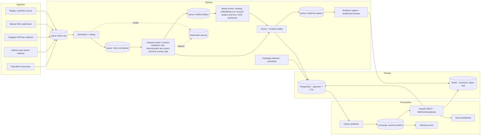

# Design Document

## Overview

Aegis is built as a **modular monolith**: one Python codebase (`aegis`) with separate entrypoints (collectors, pipeline workers, API, alerting) that deploy as separate containers from the same image. This gives most of the isolation benefits of microservices (independent scaling, a failing collector can't crash the API) without the operational cost of many independently versioned services.

Data flows through four stages:

1. **Collect** items through compliant connectors.
2. **Normalize and deduplicate** them.
3. **Detect and score** them, turning results into incidents.
4. **Present** incidents through a live dashboard and alerts.

PostgreSQL is the single system of record. It also handles full-text search (FTS), vector similarity (pgvector), and relationship storage at MVP scale. Specialized stores (Elasticsearch, Neo4j) are deferred until measurements show they are needed.

### Design Principles

1. **Decide, don't list alternatives.** Each concern has one MVP choice and one named upgrade path, triggered by a measurable condition.
2. **Vertical slice first.** A single source flows end-to-end to the dashboard before more sources or detectors are added.
3. **Detectors produce detections; only the scorer creates or updates incidents.** Where a requirement says something "becomes a critical incident" (fingerprint leaks, solicitation by an impersonator, specific violent threats), it is implemented as a detection plus a scoring override, never as a detector writing an incident.
4. **Every flag is explainable.** Each incident carries the detections, scores, and spans that produced it.
5. **Measure quality.** Detector changes are gated on a labelled evaluation set.
6. **Compliant access only.** Each source uses a documented, terms-compliant access method. Anything else goes through manual URL submission.

## Migration Stance (decided 2026-10-01)

**Hard reset.** The existing code predates this design (Elasticsearch, Scrapy/Selenium, Twitter-first, top-level packages), so it is not extended or wrapped.

- **Legacy code:**
  - Before removal, the current state is preserved as tag `legacy-v0` and branch `legacy/v0`.
  - `shared/`, `messaging/`, `ingestion/`, `scraping/`, `storage/`, `api/`, `processing/` and their tests are then deleted from `main`, along with `start.py` and `.flake8`.
  - Nothing is imported from them. The old initial schema and message format only serve as reference when writing tasks 2.1 and 2.2.
- **Tooling retargeted to `aegis/`:**
  - `pyproject.toml` with `requires-python = ">=3.12,<3.13"` and a regenerated `uv.lock`
  - `Dockerfile` (`python:3.12-slim`, one image, multiple entrypoints)
  - `docker-compose.yml`: Postgres 16 + pgvector, RabbitMQ, and MinIO, plus the api and worker services. Elasticsearch and Redis are removed.
  - CI: ruff, mypy, pytest, and pip-audit. The frontend checks and the eval gate are added when tasks 9.4 and 18.2 land.
  - `.env.example`, `Makefile`, `README.md`, pytest config, and `.dockerignore`
- **Dependencies:** the target set is added per phase, so the base image stays small until a task needs more. Heavy ML and browser dependencies go in optional groups.
  - **Core (Phase 0–1):** fastapi, uvicorn, pydantic, pydantic-settings, sqlalchemy, alembic, psycopg (with pool) or asyncpg, pgvector, aio-pika, minio, structlog, prometheus-client, tenacity, pybreaker, httpx (needed for the GitHub API, manual URL fetch, and LLM calls), pyjwt, argon2-cffi, pyotp, pyahocorasick
  - **`collectors` group:** telethon
  - **`media` group:** imagehash, open-clip-torch (brings torch transitively), paddleocr, datasketch, sentence-transformers
  - **`capture` group:** playwright
  - **Removed:** elasticsearch, redis, scrapy, selenium, transformers (direct), spacy, opencv-python, celery, tweepy, python-telegram-bot, python-jose, passlib, aiofiles

## Architecture



### Data Flow

1. **Collectors** publish raw items to `items.raw`. Collectors are stateless apart from cursors, which are stored in Postgres.
2. **Normalizer:**
   - validates items against the common schema (invalid items go to the DLQ)
   - computes the dedup key
   - upserts the account and item
   - detects language and script
   - publishes to `items.normalized`
3. **Analysis worker:** resolves VIP mentions. Items with no VIP mention and no leak indicators stop here and are retained only for the short retention window. For the rest, the worker runs text, impersonation, and leak detectors in-process, which keeps latency low. Items with media are forked to `media.analyze`.
4. **Media worker:** a separate queue and process, because hashing, embeddings, OCR, and video work are CPU/GPU heavy. It also handles `account_profile` jobs (avatar and bio embeddings for impersonation scoring) and publishes `account.embedded` when one finishes. OCR text is fed back into text detection.
5. **Scorer:** combines detections into a risk score and severity. The incident is written in the same transaction as an **outbox** row. If the incident meets the capture threshold, it enqueues evidence capture.
6. **Outbox publisher:** routes each committed outbox row by its `event_type` to the matching exchange: incident events to `events.incidents`, configuration events to `events.config`. This guarantees no event is lost and none is published for a rolled-back change.
7. **Consumers of `events.incidents`:**
   - The **WebSocket gateway** pushes events to connected dashboards, filtered by each user's VIP scope.
   - The **alerting service** evaluates alert rules.
8. **Campaign detector:** runs every 5 minutes per VIP over a sliding window. It writes campaigns and links incidents to them.

### Queue Topology (RabbitMQ)

- Quorum queues with publisher confirms. Consumers acknowledge only after the database commit, which together with dedup keys gives effectively-once processing.
- Every work queue has a DLQ. Messages move to the DLQ after N retries with exponential backoff (via a delayed-retry queue).
- `items.normalized` uses message priority: manual submissions and items from accounts already linked to open incidents get higher priority.
- Prefetch is tuned per worker type: high for the analysis worker, low (1–2) for the media worker and evidence capture.

All queues and exchanges:

| Name | Type | Producer → consumer | Purpose |
|---|---|---|---|
| `items.raw` | quorum queue | collectors → normalizer | raw collected items |
| `items.normalized` | quorum queue (priority) | normalizer → analysis worker | normalized items |
| `media.analyze` | quorum queue | analysis worker → media worker | item media jobs and `account_profile` jobs |
| `evidence.capture` | quorum queue | scorer → capture service | evidence capture jobs |
| `events.incidents` | topic exchange | outbox publisher → WebSocket gateway and alerting (one queue each) | incident created/updated/merged |
| `events.accounts` | topic exchange | media worker → analysis worker via quorum queue `analysis.account_embedded` (routing key `account.embedded`) | profile embeddings ready; triggers final impersonation scoring |
| `events.config` | fanout exchange | API (via the outbox) → (a) every worker instance, each with its own exclusive auto-delete queue, for cache and mention-automaton invalidation; (b) one durable quorum queue `config.recompute`, consumed competitively by analysis workers so each event is processed by exactly one of them | VIP configuration changed |
| `*.dlq` | quorum queue per work queue | — | dead letters after retries |

The two `events.config` bindings have different guarantees:

- **Per-instance cache queues** are only an invalidation hint. Losing a message (e.g., a worker restarting) is harmless because the 60-second cache TTL is the backstop.
- **`config.recompute`** drives the impersonation re-scoring batch (see Impersonation Detection), so it must run once per change and must not be lost:
  - Config changes are written through the transactional outbox, like incident changes.
  - The consumer takes a Postgres advisory lock keyed on the VIP (`pg_try_advisory_lock`) for the duration of the batch. A redelivered or overlapping event for the same VIP waits or is skipped.
  - The batch is idempotent: it only touches rows whose `vip_config_version` is behind `vips.config_version`.
  - An hourly sweeper re-enqueues any VIP that still has rows behind its current version, which covers a lost or failed batch.

`account.embedded` is durable because it drives scoring.

### Capacity Targets

From the scale assumptions in the requirements:

- **Average:** 200,000 items/day ≈ 2.3 items/s. **Sustained design rate:** 10 items/s. **Burst:** 50 items/s for up to 15 minutes.
- A 15-minute burst delivers 45,000 items. For the queues to drain within 10 minutes after the burst (while 10 items/s keep arriving), the text path needs a processing capacity C that satisfies (50 − C) · 900 ≤ (C − 10) · 600, which gives **C ≥ 34 items/s**. Size analysis workers for 35 items/s.
- The media path is sized from the measured share of items with media. It must meet the same 10-minute drain target, verified in the load test (task 20.3).
- Latency targets (Req 14.1, 19.2) apply at the sustained rate. During a burst, latency degrades until the backlog drains.

## Source Access Matrix

| Source | Access method | Key constraints | Phase |
|---|---|---|---|
| Replay / synthetic | JSONL replay with original timing, plus a synthetic generator | None; primary dev/test/demo source | MVP |
| Manual URL submission | Analyst pastes a URL; server-side fetch with platform extractors, falling back to screenshot plus analyst-entered text | SSRF protection required; works for any platform including LinkedIn | MVP |
| Telegram public channels | MTProto client (Telethon) on a dedicated monitoring account (API ID/hash from my.telegram.org), joined to configured public channels | Bot API can only read channels the bot was added to; handle FloodWait; review Telegram ToS | MVP |
| GitHub | Authenticated REST code search API | Strict per-minute search rate limit; scraping HTML is against ToS and unreliable | MVP |
| X / Twitter | API v2 recent search or filtered stream | Requires a paid access tier; volume caps | Post-MVP |
| Facebook | Graph API on Pages the VIP owns (comments and mentions via Page token) | No general public-post search | Post-MVP |
| Instagram | Graph API on VIP-owned Business/Creator accounts (comments, mentions) plus hashtag search | Hashtag search is limited to a small number of unique hashtags per rolling week | Post-MVP |
| YouTube | Data API v3 (commentThreads on VIP channels and on videos found by search) | Daily quota units | Post-MVP |
| Discord | Bot in servers it is invited to (e.g., VIP communities) | Self-bots violate ToS; no access to arbitrary servers | Post-MVP |
| Pastebin | Scraping API | Requires a PRO account and a whitelisted IP | Post-MVP |
| LinkedIn | Manual URL submission only | No compliant API for third-party content monitoring | n/a |

Each connector declares its access method, rate-limit policy, and staleness window in config. The ToS review for each source is recorded in the data-protection documentation (Req 18.5).

## Common Item Schema (v1)

```json
{
  "schema_version": "1.0",
  "source": "telegram | github | manual | replay | x | facebook | instagram | youtube | discord | pastebin",
  "platform_item_id": "string",
  "dedup_key": "sha256(source + ':' + platform_item_id)",
  "item_type": "post | comment | reply | message | paste | code_file",
  "url": "string",
  "posted_at": "RFC3339 | null",
  "collected_at": "RFC3339",
  "author": {
    "platform_account_id": "string",
    "handle": "string",
    "display_name": "string | null",
    "bio": "string | null",
    "avatar_url": "string | null",
    "created_at": "RFC3339 | null",
    "followers": "int | null",
    "following": "int | null",
    "verified": "bool | null",
    "self_labels": ["parody", "fan"]
  },
  "content": {
    "text": "string",
    "language": "set by normalizer (ISO 639-1 or 'hi-Latn' for romanized Hindi)",
    "script": "set by normalizer"
  },
  "media": [
    { "url": "string", "type": "image | video | file", "platform_media_id": "string | null" }
  ],
  "relations": {
    "reply_to": "platform_item_id | null",
    "repost_of": "platform_item_id | null",
    "quote_of": "platform_item_id | null",
    "mentions": ["handle"],
    "hashtags": ["string"]
  },
  "engagement": { "likes": "int | null", "shares": "int | null", "replies": "int | null", "views": "int | null" },
  "collection": { "connector": "string", "connector_version": "string", "query": "string | null" },
  "raw": "object (original payload, stored verbatim)"
}
```

Schemas are defined as Pydantic models, and a JSON Schema is exported for contract tests. Breaking changes bump the major version. The normalizer accepts the current and previous major versions.

## Data Model (PostgreSQL)

### VIPs and reference data

| Table | Key columns |
|---|---|
| `vips` | id, name, sensitivity (low/normal/high), monitoring_active, scoring_profile_id, config_version (incremented on every configuration change), created_at |
| `vip_aliases` | vip_id, alias, kind (name/nickname/transliteration/handle/hashtag), is_ambiguous |
| `vip_context_keywords` | vip_id, keyword (used to disambiguate common names) |
| `official_accounts` | vip_id, source, platform_account_id, handle, display_name, bio, bio_embedding vector(384), avatar_object_key, avatar_phash, avatar_embedding vector(512), verification_evidence, verified_by, verified_at, profile_refreshed_at |
| `reference_media` | vip_id, object_key, kind (portrait/avatar/official_media), phash, dhash, embedding vector(512) |
| `sensitive_fingerprints` | vip_id, kind (phone/email/address_token/other), salted_hash, salt_id. No plaintext is stored |

### Collected data

| Table | Key columns |
|---|---|
| `accounts` | id, source, platform_account_id (unique per source), handle, display_name, bio, bio_embedding vector(384), avatar_object_key, avatar_phash, avatar_embedding vector(512), created_at_platform, followers, following, verified, self_labels, discovered_via (authored_item/mention/manual_profile/profile_search), first_seen_at, profile_hash (detects profile changes), tsv (tsvector over handle, display_name, bio) |
| `items` | id, dedup_key (unique), source, platform_item_id, account_id, item_type, url, posted_at, collected_at, text, language, script, ocr_text, tsv (tsvector), engagement jsonb (latest), scored_reach, relations jsonb, raw jsonb, removed_at, schema_version |
| `item_engagement_snapshots` | item_id, observed_at, engagement jsonb (one row per observed engagement update) |
| `account_vip_scores` | account_id, vip_id, state (screened_out/pending_embeddings/scored/partial/stale), prescreen_score, score, components jsonb, profile_hash, vip_config_version, scored_at |
| `item_versions` | item_id, observed_at, text, change_type (edit/delete) |
| `item_vips` | item_id, vip_id, match_confidence, match_source (alias/handle/hashtag/media), matched_value |
| `media` | id, item_id, content_sha256 (dedup), object_key, type, phash, dhash, embedding vector(512), first_seen_at, first_seen_item_id |

### Detection and incidents

| Table | Key columns |
|---|---|
| `detections` | id, scope (item/account), item_id (nullable), account_id (nullable), vip_id (nullable), detector, model_version, score, label, spans jsonb, details jsonb, created_at |
| `incidents` | id, subject_type (item/account), item_id (nullable), account_id (nullable), subject_vip_id (account incidents only), source, language, risk_score, severity, severity_manual (bool), threat_types text[], explanation, status, assignee_id, campaign_id, scoring_config_version, outcome, source_removed, merged_into_id (nullable FK to incidents; set when an item incident is merged into an account incident), below_threshold (bool, default false; account incidents only), created_at, updated_at |
| `incident_vips` | incident_id, vip_id |
| `incident_items` | incident_id, item_id, attached_at, item_risk (the item's risk for this incident's VIP at attachment, used by account scoring) |
| `incident_events` | incident_id, at, actor_id (null for system), event_type (status_change/assign/note/severity_override/rescore/item_attached/merged_into/campaign_linked), from_value, to_value, reason |
| `incident_notes` | incident_id, author_id, body, created_at |
| `scoring_configs` | version, weights jsonb, bands jsonb, overrides jsonb, created_by, created_at |

### Campaigns and graph

| Table | Key columns |
|---|---|
| `campaigns` | id, vip_id, status (open/closed), first_seen_at, last_seen_at, account_count, item_count, coordination_score, summary |
| `campaign_members` | campaign_id, account_id, item_id |
| `account_edges` | src_account_id, dst_account_id, edge_type (reply/repost/mention/co_cluster), weight, first_seen_at, last_seen_at |

### Evidence, alerts, feedback, access

| Table | Key columns |
|---|---|
| `evidence_artifacts` | id, incident_id, kind (raw/screenshot/html/media/account_snapshot), object_key, sha256, size, captured_at |
| `evidence_manifests` | incident_id, version, manifest_object_key, manifest_sha256, prev_manifest_sha256, created_at, tsa_token (post-MVP) |
| `custody_log` | id, target_type (artifact/manifest), artifact_id (nullable), manifest_incident_id + manifest_version (nullable, FK to `evidence_manifests`), actor_id, action (view/download/export), at. A check constraint requires exactly the columns for `target_type` to be set, the same pattern as incident subjects |
| `alert_rules` | scope (vip/user), min_severity, channels, quiet_hours, escalation_after, secondary_recipient |
| `alerts` / `alert_deliveries` | alert_id, incident_ids, channel, recipient, status, attempts, acknowledged_at |
| `labels` | item_id (nullable: null for account incidents), incident_id, account_id (nullable), labeller_id, label (fp/tp/corrected_type/corrected_severity), value, created_at |
| `suppression_rules` | scope, match (account/keyword/domain), reason, expires_at, created_by |
| `users` / `user_vip_scopes` | users: role (admin/lead/analyst/viewer), mfa_enabled; user_vip_scopes: user_id, vip_id, can_reveal_sensitive (bool, default false) |
| `audit_log` | append-only (insert-only DB grant), actor_id, action, target, details, at |
| `outbox` | id, event_type, payload, created_at, published_at |
| `saved_searches` | user_id, name, query jsonb |

### Incident subjects and detection scope

Most incidents are about one item. Impersonation is about an account, which may post many items or none at all. Incidents therefore have one of two subjects:

| Subject | Set columns | Uniqueness | Created by |
|---|---|---|---|
| `item` | `item_id` | one incident per item | all detectors except impersonation |
| `account` | `account_id`, `subject_vip_id` | one open incident per (account, VIP); status not Resolved or False Positive | `impersonation` detections |

A check constraint enforces that exactly the columns for the chosen `subject_type` are set.

**`incident_vips` is the single source of truth for an incident's VIPs.** Account incidents insert one `incident_vips` row for `subject_vip_id` in the same transaction that creates them; `subject_vip_id` exists only to back the uniqueness index. VIP-scoped WebSocket push, alert rules, API scope filtering, and the VIP filter all read `incident_vips` and never `subject_vip_id`.

**Detection scope** (also enforced by a check constraint):

| Detector | Scope | item_id | account_id | vip_id |
|---|---|---|---|---|
| `text_lexicon`, `text_toxicity`, `text_intent_llm`, `solicitation`, `leak_pattern`, `campaign_member` | item | required | — | required |
| `leak_fingerprint_match` | item | required | — | required (the matched VIP) |
| `repurposed_media` | item | required | — | nullable: null when the earlier occurrence is not tied to any VIP and the item's VIP link is only by media |
| `impersonation` | account | nullable: the item that brought the account into view, if any | required | required |

Detections with a null `vip_id` never create an incident on their own. They are kept for context and search, and contribute to scoring only when the item already has a VIP link through `item_vips`. In that case they count toward every VIP linked to the item (see Severity Scoring).

**Labels** follow the incident's subject. For an item incident, `labels.item_id` is set. For an account incident, `labels.item_id` is null and the label is keyed by `incident_id` and `account_id`. A False Positive on an account incident labels the `impersonation` detection, not the attached items' detections.

### Keys

- Tables with an `id` column use a UUID primary key.
- Junction and mapping tables use composite primary keys:
  - `vip_aliases`: (vip_id, alias, kind)
  - `vip_context_keywords`: (vip_id, keyword)
  - `item_vips`: (item_id, vip_id)
  - `incident_vips`: (incident_id, vip_id)
  - `campaign_members`: (campaign_id, item_id), with a secondary index on (campaign_id, account_id)
  - `account_edges`: (src_account_id, dst_account_id, edge_type)
  - `user_vip_scopes`: (user_id, vip_id)
  - `incident_items`: (incident_id, item_id)
  - `item_engagement_snapshots`: (item_id, observed_at)
  - `evidence_manifests`: (incident_id, version)
  - `account_vip_scores`: (account_id, vip_id)
- `official_accounts` is unique on (source, platform_account_id); `accounts` likewise.
- `incidents` has two partial unique indexes: `(item_id) WHERE subject_type = 'item'` and `(account_id, subject_vip_id) WHERE subject_type = 'account' AND status NOT IN ('resolved', 'false_positive')`.

### Indexes

- unique `items.dedup_key`
- GIN on `items.tsv`
- GIN trigram on `accounts.handle` / `display_name`
- HNSW on `media.embedding` and `reference_media.embedding`
- B-tree on `incidents (severity, created_at desc)` and `(status, assignee_id)`
- B-tree on `item_vips (vip_id)`
- B-tree on `items (language)`, `incidents (campaign_id)`, `incidents (source)`, `incidents (language)`. `source` and `language` are copied onto incidents at creation so the dashboard filters (Req 12.1) don't need joins. For account incidents, `source` is the account's platform (always known) and `language` is null; the language filter excludes them unless "no language" is selected.
- GIN on `accounts.tsv` (a `simple`-config tsvector over handle, display_name, and bio) for full-text search over account names
- B-tree on `detections (detector, created_at)`, `detections (item_id)`, `detections (account_id, vip_id)`
- B-tree on `incident_items (item_id)`
- B-tree on `account_vip_scores (vip_id, state)` for VIP-wide invalidation and re-scoring
- Partial B-tree on `incidents (created_at DESC) WHERE merged_into_id IS NULL` for the default feed, which excludes merged incidents (an "include merged" filter shows them)
- HNSW on `accounts.avatar_embedding` and `official_accounts.avatar_embedding`

## VIP Management (Req 1)

- **Config propagation:** workers cache VIP configuration with a 60-second TTL and also subscribe to `config.changed` on the `events.config` fanout exchange (see Queue Topology). A change (including pausing monitoring) takes effect within about a minute, inside the 5-minute requirement. The mention automaton is rebuilt on each change, and impersonation scores for that VIP are invalidated (see Impersonation Detection).
- **Official accounts:** an Admin or Lead records verification evidence (e.g., a link from the VIP's official website or a platform verification badge). Only verified official accounts are excluded from impersonation scoring.
- **Sensitive fingerprints:** the registration endpoint receives values over TLS, normalizes them, hashes them with the active salt, and discards the plaintext. A log filter scrubs the request body. Because the plaintext is never stored, rotating a salt requires re-entering the values; old salts stay active until that happens.
- **Audit:** every VIP configuration change is written to `audit_log` with the before and after values (fingerprints are recorded only as "added" or "removed").

## Detection Pipeline

### Mention Resolution (Req 4)

- Build an Aho-Corasick automaton (`pyahocorasick`) per deployment from all aliases. Rebuild it when VIP config changes.
- Match against three forms of the text:
  - the original text
  - a normalized form (NFKC, lowercase, confusables skeleton)
  - for romanized Hindi, a transliterated Devanagari form (e.g., AI4Bharat IndicXlit), plus Devanagari aliases transliterated to Latin
- Also match handles in `relations.mentions` and hashtags.
- For aliases marked `is_ambiguous`, require at least one context keyword within the item or the author's recent items. Otherwise record a low match confidence (0.4), which the scorer applies through `mention_mult` (see Severity Scoring).

### Text Threat Detection (Req 5): a three-stage cascade

1. **Stage 1 (cheap, every VIP-linked item):**
   - curated lexicons for English, Hindi, and Hinglish, covering threat verbs, weapons, location/time markers, and slurs
   - a multilingual toxicity model (XLM-R based, e.g., Detoxify multilingual)
   
   Items scoring below `stage1_threshold` on both signals stop here.
2. **Stage 2 (threat-intent classifier):**
   - **MVP:** every VIP-linked item that passes Stage 1 is classified by an LLM with a strict JSON schema: `{intent: none|criticism|harassment|violent_threat|incitement|doxxing, intent_probs: {<each of the six labels>: 0–1, summing to 1}, solicitation: none|money|credentials|personal_info, target_vip, specificity: {location, time, method}, rationale, spans}`. This runs under a daily token budget. When the budget is exhausted, the system falls back to Stage 1 scores and flags `degraded_classification`. There is no uncertainty-band gating at MVP, because there is no trained classifier yet to produce the band.
   - **Post-MVP:** a fine-tuned MuRIL or XLM-R classifier trained on analyst labels plus LLM-labelled data. After that, the LLM is used only for items in the classifier's uncertainty band (Req 5.4).
3. **Explanation:** spans and rationale are stored on the detection and rendered in the incident view.

The six intent labels above are canonical. Requirements, database values, the UI, and the evaluation set all use them verbatim. Sentiment is not used as a threat signal.

**Threat probability (what the scorer consumes):** the `text_intent_llm` detection stores the predicted label, but its score is the probability that the item is threatening, not the confidence in whichever label won:

```
threat_prob = P(harassment) + P(violent_threat) + P(incitement) + P(doxxing)
```

`criticism` and `none` therefore contribute nothing, however confident the model is. LLM-reported probabilities are not reliably calibrated, so `threat_prob` is passed through an isotonic calibrator fitted on the golden set (refitted whenever the prompt or model changes) before it reaches the scorer.

**Threat-class signals:** the criticism cap (see Severity Scoring) depends on whether any of these is present on the item:

- `text_intent_llm` with calibrated `threat_prob` ≥ 0.5
- a `text_lexicon` hit in a threat category (threat verbs, weapons, location/time specificity markers). Abuse and slur categories alone are not threat-class.
- any `impersonation`, `leak_pattern`, `leak_fingerprint_match`, `repurposed_media`, or `campaign_member` detection, or a `solicitation` detection on an item attached to an account incident

`text_toxicity` is never threat-class: toxic criticism is still criticism.

**Data handling:** sending content to a third-party LLM requires a provider agreement that permits it and must be covered in the data-protection documentation. Alternatively, use a self-hosted model.

### Impersonation Detection (Req 6)

**Candidate generation:** an account is scored against a VIP when it either:

- authors an item linked to that VIP, or
- has a normalized handle or display name containing a VIP alias token.

The second rule also covers accounts the system knows only from their profile, with no authored item: accounts named in an item's mentions or replies, profile URLs submitted manually by an analyst, and (post-MVP) platform profile search. `accounts.discovered_via` records how each account was found.

Scores are cached per (account, VIP) in `account_vip_scores` and recomputed when either side changes:

- **The account's profile changes** (`profile_hash` differs): rescore that account from the pre-screen, with new embeddings if the avatar or bio changed.
- **The VIP's configuration changes:** each `vips` row carries a `config_version` that increments on every change, and every score row records the `vip_config_version` it was computed against. On a `config.changed` event for a VIP, a background job does the cheapest work that keeps every row correct:
  - **Threshold change only:** re-evaluate each `scored` or `partial` row against the new threshold, without recomputing components. A lowered threshold can push accounts above it, which produces new `impersonation` detections and incidents as usual. A raised threshold can leave an account with an open incident below it, handled as follows.
  - **Account falls below the threshold with an open incident:** the original `impersonation` detection stays as a historical record; the score row records the new result.
    - **Auto-resolve** with the system outcome `below_threshold` and an `incident_events` row (actor null, reason naming the config version) only if all of these hold:
      - no analyst has acted on the incident (still New, unassigned, no notes)
      - it is not critical
      - none of its attached items has `item_risk` ≥ 0.55 (medium)
    - **Otherwise keep it open** and set `incidents.below_threshold = true` (shown as a badge in the UI; a `rescore` event records why), so a reviewer decides. This applies when the incident is critical, an analyst has engaged, or an attached item carries a real threat. The flag is a stored column rather than derived from `account_vip_scores`, so the feed can filter on it without a join against each VIP's current threshold. It is cleared if a later re-score puts the account back above the threshold.
    - Resolved and False Positive incidents are never touched.
    - Merged item incidents stay merged; the account incident's timeline still lists them.
    - Without an impersonation finding, the `solicitation` override no longer applies on re-score. A flagged incident therefore keeps the severity it had until a reviewer acts. An auto-resolved one cannot be critical by construction.
  - **Alias, official account, or reference media change:** mark the VIP's rows `stale`, then recompute them in batches. Handle, name, and metadata components are recomputed directly. Avatar and bio components are recomputed against the new references from the embeddings already stored on `accounts`, so the media worker is needed only for accounts that have no embeddings yet.
  - Until a stale row is recomputed, its previous score stays in effect.

**Two-phase scoring (keeps embedding work off the analysis worker):** avatar and bio embeddings are CPU/GPU-heavy, so they run in the media worker like all other embedding work. Impersonation scoring is therefore asynchronous.

1. **Pre-screen (analysis worker, synchronous, cheap):** compute handle similarity, display-name similarity, and metadata risk.
   - These components carry at most 0.65 of the total weight, below the 0.70 threshold. A pre-screen alone can therefore never produce an incident.
   - If the pre-screen is at least 0.35, or the handle or display name contains a VIP alias token, set the (account, VIP) row to `pending_embeddings` and enqueue an `account_profile` job on `media.analyze`.
   - Otherwise set the row to `screened_out`.
2. **Embedding (media worker):** the worker downloads the avatar through the safe-download path and computes `avatar_phash`, `avatar_embedding` (OpenCLIP), and `bio_embedding`. For the bio it uses a multilingual sentence-embedding model (e.g., paraphrase-multilingual-MiniLM-L12-v2, 384 dimensions). It writes them to `accounts` and publishes `account.embedded`.
3. **Final scoring (analysis worker, on `account.embedded`):** compute the avatar and bio components, combine with the stored pre-screen components, set the row to `scored`, and emit the `impersonation` detection if the score is above the threshold.
   - If the embedding job fails after retries, or doesn't finish within 10 minutes, the account is scored with the avatar and bio components set to 0 and the row marked `partial`. This can still cross the threshold through handle, name, and metadata only when an analyst has lowered that VIP's threshold.

Until an account reaches `scored`, the UI shows it as "impersonation check pending" on any item incident it authored. Impersonation incidents therefore arrive within the media-path latency target (5 minutes, Req 19.2), not the text-path target.

Official accounts get the same fields through the same `account_profile` job. The data is filled from the platform when the source allows, refreshed daily, and otherwise entered by an Admin during VIP setup.

**Normalization:**

1. NFKC normalization
2. Unicode confusables skeleton (UTS #39, via ICU `SpoofChecker` or the `confusable_homoglyphs` package)
3. Lowercasing
4. Stripping separators (`_ . -`)
5. Leetspeak mapping (`0→o, 1→l/i, 3→e, 4→a, 5→s, 7→t`)
6. Stripping filler tokens ("official", "real", "the", "india", digits suffix)

**Component scores (each 0–1):**

| Component | Method | Default weight |
|---|---|---|
| Handle similarity | max(Jaro-Winkler, 1 − normalized Levenshtein) on skeletons, vs. each official handle | 0.30 |
| Display-name similarity | same, vs. VIP name and aliases | 0.20 |
| Avatar similarity | max over references of: pHash Hamming distance mapped to 0–1, and CLIP cosine between `accounts.avatar_embedding` and official avatars plus `reference_media` portraits | 0.25 |
| Bio similarity | cosine between `accounts.bio_embedding` and `official_accounts.bio_embedding` | 0.10 |
| Metadata risk | account age < 90 days, low followers with a high following ratio, unverified while the official account is verified | 0.15 |

- Self-labels (parody/fan) multiply the score by 0.5 and are shown on the incident.
- The default threshold is 0.70, configurable per VIP. A final score above the threshold produces an account-scoped `impersonation` detection; the scorer turns it into an account incident.
- **One incident per impersonator:** account incidents are grouped per (account, VIP), so an impersonator posting five items produces one incident, not five.
  - When the account incident is created, the account's VIP-linked items from the last 30 days are attached to it.
  - Every later VIP-linked item by that account is attached to the open incident through `incident_items` instead of creating its own item incident. Its detections (text, solicitation, leak) are scored as an item, and the result feeds the account incident's score as described under Severity Scoring → Account incidents. The incident is re-scored on each attachment (event type `item_attached`, then `rescore`).
  - **Reconciling items that already have their own incident:** impersonation scoring is asynchronous, so an item can get its own item incident before its author is flagged. When such an item attaches, the two incidents are reconciled in one transaction, so an item never feeds two live incidents and the feed never shows it twice:

    | Existing item incident status | What happens to the item incident | `item_risk` used for the account incident |
    |---|---|---|
    | New, Under Review, Escalated | `merged_into_id` set to the account incident; frozen (no further scoring); hidden from the default feed; status, notes, history, and assignee kept | its current risk; if `severity_manual`, the lower bound of the analyst's chosen band (low 0.30, medium 0.55, high 0.75, critical 0.90) |
    | Resolved | `merged_into_id` set, otherwise untouched | its current risk |
    | False Positive | `merged_into_id` set, otherwise untouched | 0, so the analyst's judgment that the item was not a threat stands |

    - Both incidents get an event: `merged_into` on the item incident, and `item_attached` with the item incident's ID on the account incident.
    - If the account incident has no assignee, it inherits the merged incident's assignee.
    - The merged incident's detail view shows a banner linking to the account incident, which lists merged incidents in its attached-item timeline.
    - Re-scoring triggers for a merged item (reach growth, campaign membership) go to the account incident.
    - Merging emits an outbox update for both incidents. Alerting treats it as an update to the account incident and alerts again only if its severity crosses a rule's threshold.
    - **Visibility:**
      - Merged incidents are excluded from the default feed and from default search results. The "include merged" filter shows them, linked to their account incident.
      - Over WebSocket, the gateway pushes `{type: "merged", incident_id, merged_into_id}`. Clients remove the merged card and refetch the account incident, and they discard later events for an incident ID they hold as merged. The merged incident stays reachable by direct link.
    - **Campaign link:**
      - If the account incident has no `campaign_id`, it takes the merged incident's.
      - If both have different campaigns, the account incident keeps its own, and the item remains a member of its campaign through `campaign_members`, which is keyed by item.
      - The merged incident keeps its `campaign_id` for history.
      - The campaign view resolves each member item to its live incident (the account incident when merged). It therefore never shows a frozen incident as actionable, and bulk campaign actions act on each live incident once.
  - If the account's incident was Resolved, new evidence opens a new account incident that links to the earlier one.
  - If it was marked False Positive, the system creates a suppression rule for that (account, VIP) with a 90-day expiry, so it is not re-flagged until the profile changes or the rule expires.
- Official accounts are excluded.
- The report package is a generated PDF plus artifacts, with the official and suspect profiles side by side. Analyst confirmation gates the report package only; it is not needed for scoring.

**Solicitation (the scoring-time signal for the critical override, Req 6.7):** for every VIP-linked item, the analysis worker records a `solicitation` detection when either of the conditions below holds. The pattern check is cheap, so it runs synchronously. Because the impersonation score may still be pending, the detection is stored inert: it has no weight on item incidents, and it takes effect (weight and override) only once the item is attached to an account incident. This keeps the Req 6.7 condition of "account above the impersonation threshold" without making the analysis worker wait for embeddings. The conditions are:

- the Stage 2 LLM returns `solicitation` other than `none`, or
- the text matches solicitation patterns:
  - UPI IDs (handle@suffix, matched against a maintained list of UPI handle suffixes so ordinary emails don't match)
  - crypto wallet addresses (BTC, ETH, USDT formats)
  - bank account number plus IFSC patterns
  - OTP, PIN, or password requests (lexicon, English/Hindi/Hinglish)
  - links to domains not on the VIP's official-domain list

The scorer's override makes the account incident critical as soon as any attached item carries a `solicitation` detection.

### Media Analysis (Req 7)

- **Download:** size and type limits, MIME sniffing, ClamAV scan, and SHA-256 content dedup. Media are stored in MinIO.
- **Fingerprinting:** pHash and dHash (`imagehash`), plus an OpenCLIP ViT-B/32 embedding stored in pgvector.
- **Matching:**
  - pHash Hamming distance ≤ 8 (of 64 bits) gives a near-duplicate.
  - CLIP cosine ≥ 0.92 gives a semantic match, which catches crops, overlays, and recompression.
  - Matches against `reference_media` link the item to the VIP by writing an `item_vips` row with `match_source = media`. This is a VIP link, not a scored detection.
  - Matches against prior `media` reveal reuse. If `first_seen_at` predates the current item's context by more than a configurable gap, or the first sighting came from a different source, the system raises a `repurposed_media` detection that shows the earliest occurrence.
- **OCR:** PaddleOCR with English and Devanagari models. Extracted text goes into `items.ocr_text` and is run through text detection.
- **Video:** ffmpeg scene-change keyframes (max 1 per 2 seconds, capped at 30 per video), each processed as an image.
- **Reverse image search:** TinEye API or Google Cloud Vision Web Detection. It runs only for high-or-above incidents, within a daily quota. Results are stored as detection details.
- **Synthetic media (post-MVP):** an ensemble detector whose output is shown as "synthetic-media likelihood (signal only)". It never sets severity alone.

### Leak and PII Detection (Req 8)

- **Pattern detectors with validators:**
  - Indian mobile numbers (`(\+91[\s-]?)?[6-9]\d{9}`)
  - email addresses
  - Aadhaar format (12 digits with Verhoeff checksum)
  - PAN format (`[A-Z]{5}\d{4}[A-Z]`)
  - postal addresses (PIN code plus address-keyword heuristics)
  - secrets (gitleaks/detect-secrets rule set)
- **Fingerprint match:** each detected value is normalized (E.164 phones, lowercased emails, address token sets) and hashed with each active salt, then compared with `sensitive_fingerprints`. A match produces a `leak_fingerprint_match` detection, which the scorer's override turns into a critical incident. Non-matching PII near a VIP mention produces a `leak_pattern` detection that is scored normally.
- **Masking:**
  - Detected values are stored encrypted in `detections.details`, using application-level encryption with a separate key.
  - The API returns masked forms (e.g., `98XXXXXX21`) unless the caller holds `can_reveal_sensitive` for that VIP (see API and Real-Time Delivery). Every reveal writes to the audit log.
  - Alerts never include raw values.

### Campaign Detection (Req 9)

Runs every 5 minutes per VIP over the last W minutes (default 60).

1. **Content clustering:**
   - Normalize text (strip URLs and mentions, lowercase, transliterate).
   - Shingle into word 5-grams (3-grams for texts under 15 tokens).
   - Index with MinHash (128 permutations) and LSH at Jaccard 0.7 (`datasketch`).
   - Add edges for media near-duplicates.
   - Take connected components as clusters.
2. **Candidate test:** at least N distinct non-allowlisted accounts in a cluster within W (default N = 10).
3. **Coordination score:** a weighted combination of:
   - time compression (median inter-post gap vs. the VIP's baseline)
   - account-age clustering (share created within the same 30-day window)
   - share of accounts younger than 90 days
   - shared avatars (pHash)
   - posting-cadence similarity
   
   Candidates at or above the threshold become campaigns.
4. **Volume anomaly:**
   - Compute hourly mention counts per VIP.
   - Take the baseline as the same-hour-of-week median and MAD over 4 weeks.
   - Compute a robust z = (x − median) / (1.4826 · MAD).
   - Flag when z ≥ 4 and x ≥ a minimum count.
   
   A spike raises a campaign candidate review even without a content cluster.
5. **Graph:**
   - Record reply, repost, mention, and co-cluster edges in `account_edges`.
   - Load the campaign subgraph into NetworkX.
   - Run Louvain communities (`networkx.community.louvain_communities`, fixed seed) and degree/betweenness centrality to identify likely amplifier and seed accounts.
   - Serve the result to the UI as Cytoscape.js JSON.
6. **Merge:** if 30% or more of a new candidate's accounts or items overlap an open campaign active in the last 72 hours, attach the candidate to that campaign.
7. **Re-score:** each item that joins a confirmed campaign receives a `campaign_member` detection (score = the campaign's coordination score) and is re-scored (see Re-scoring below).

## Severity Scoring (Req 10)

For each item, the scorer takes the detections that fired and scores the item once per linked VIP.

- Let s_d ∈ [0, 1] be each detector's score.
- Let w_d ∈ [0, 1] be its reliability weight, initialized from evaluation-set precision at the operating threshold.
- For a VIP v linked to the item, the detection set D_v is every detection with `vip_id = v` plus every detection with a null `vip_id`. A null-VIP detection (e.g., `repurposed_media` against non-VIP media) therefore contributes to every VIP the item is linked to.

Detections are combined with a noisy-OR:

```
detection_v  = 1 − Π_{d ∈ D_v} (1 − w_d · s_d)
reach_mult   = clamp(0.8 + 0.08 · log10(1 + followers + engagement_total), 0.8, 1.2)
vip_mult(v)  = {low: 0.9, normal: 1.0, high: 1.15}[v.sensitivity]
mention_mult(v) = 0.5 + 0.5 · match_confidence(v)        # match_confidence from item_vips, 0–1
risk_v       = min(1, detection_v · reach_mult · vip_mult(v) · mention_mult(v))
item_risk    = max over linked VIPs of risk_v
```

The incident's severity comes from `item_risk`. Every VIP with risk_v ≥ 0.30 goes into `incident_vips`. Overrides and caps (below) are evaluated per VIP before taking the max.

**Match confidence** (set by mention resolution, used by `mention_mult`):

| How the VIP was matched | match_confidence | mention_mult |
|---|---|---|
| exact alias, official handle, or VIP hashtag | 1.0 | 1.00 |
| transliteration or confusables-normalized alias | 0.9 | 0.95 |
| ambiguous alias with a context keyword present | 0.8 | 0.90 |
| ambiguous alias with no context keyword | 0.4 | 0.70 |
| reference-media match only (`match_source = media`) | the CLIP cosine, rescaled from [0.92, 1] to [0.6, 1] | 0.80–1.00 |

Overrides still force critical regardless of `mention_mult`.

### Account incidents (impersonation)

An account incident combines one account-scoped `impersonation` detection with the items attached to it over time. Pooling every detection from every attached item into one noisy-OR would saturate to critical after a few posts, so the score is built in two parts:

```
imp_risk     = min(1, w_imp · s_imp · account_reach_mult · vip_mult(v))
               # account_reach_mult uses followers only: clamp(0.8 + 0.08 · log10(1 + followers), 0.8, 1.2)
item_risk_i  = the attached item's risk_v for this incident's VIP, computed as above with the criticism clamp applied
               (stored on incident_items.item_risk when the item attaches)
account_risk = 1 − (1 − imp_risk) · (1 − max_i item_risk_i)
```

- Only the single worst attached item counts, so posting volume alone never pushes the score up.
- An account with no attached items scores `imp_risk` alone.
- **Overrides:** a `solicitation` detection on any attached item, or a `violent_threat` override on any attached item, makes the account incident critical.
- **Re-scoring:**
  - When an item attaches, its `item_risk` is stored and `account_risk` is recomputed from the stored values (constant time).
  - A profile change recomputes `s_imp`.
  - A change to `scoring_config` recomputes everything.
- **Worked check:** w_imp = 0.85, s_imp = 0.80, 1k followers (mult 1.04), normal VIP, so imp_risk ≈ 0.71 (medium). Attaching a capped criticism item (clamped to ≤ 0.54) gives at most 1 − 0.29 · 0.46 ≈ 0.87 (high). Attaching ten more such items changes nothing. Attaching one item with a UPI ID makes the incident critical.

| Band | Risk |
|---|---|
| No incident (detections stored only) | < 0.30 |
| Low | 0.30 – 0.55 |
| Medium | 0.55 – 0.75 |
| High | 0.75 – 0.90 |
| Critical | ≥ 0.90 |

### Detector reliability weights (scoring config v1)

These are starting values, to be replaced by evaluation-set precision once task 4.2 produces it.

| Detector | Score it emits (s_d) | v1 weight (w_d) |
|---|---|---|
| `text_lexicon` | normalized lexicon hit strength | 0.45 |
| `text_toxicity` | toxicity probability | 0.55 |
| `text_intent_llm` | calibrated threat probability (`criticism` and `none` contribute 0) | 0.80 |
| `impersonation` | profile score | 0.85 |
| `solicitation` | 1.0 when present | 0.90, plus override; counts only on items attached to an account incident (0 on item incidents) |
| `repurposed_media` | match confidence | 0.65 |
| `leak_pattern` | pattern confidence | 0.70 |
| `leak_fingerprint_match` | 1.0 | 1.00, plus override |
| `campaign_member` | campaign coordination score | 0.50 |
| `synthetic_media` (post-MVP) | likelihood | 0.30 |

**Default capture severity:** medium. Raw payloads are always kept on the item; capture adds the screenshot, page HTML, original media, and account snapshot (Req 13.1).

**Overrides to critical:**

- `text_intent_llm` = `violent_threat` with any specificity (location, time, or method)
- `leak_fingerprint_match`
- an account incident (`impersonation`) with any attached item carrying `solicitation`

**Caps:**

- **Criticism cap (Req 5.6):** if no threat-class signal is present on the item (see Text Threat Detection), the score itself is clamped: `risk_v = min(risk_v, 0.54)`, just below the low/medium boundary. Severity is therefore low, and anything that consumes the score (account-incident aggregation, re-scoring) sees the clamped value, not the raw one. This applies even when `text_toxicity` or abuse-category lexicon hits push the computed risk higher. It also holds in `degraded_classification` mode, where only threat-category lexicon hits can lift the cap.
- An active suppression rule prevents incident creation; the suppression is recorded on the detection.

**Worked check:** a criticism item the LLM is 90% sure about has `threat_prob` ≈ 0.05, contributing 0.04. With toxicity 0.9 (0.55 × 0.9 = 0.50), noisy-OR gives about 0.52, already below the 0.54 clamp, so it stays low. Had it been 0.70, the clamp would set it to 0.54.

**Explanation:** generated from a template, e.g. *"Violent threat (LLM classifier 0.86; lexicon hit: 'X'), mentions VIP Y; author account 12 days old; reach 4.2k."*

The weights, bands, and overrides form a versioned `scoring_config`. All initial values are starting points, to be tuned against the evaluation set before launch.

### Re-scoring (Req 10.7)

- **Triggers:**
  - an item joins a confirmed campaign (adds a `campaign_member` detection)
  - an engagement update raises an item's reach by an order of magnitude. Reach is `followers + engagement_total`, the same quantity the reach multiplier uses. Each item stores `scored_reach`, the reach used at its last scoring. When the normalizer applies an engagement update, it appends a row to `item_engagement_snapshots` and triggers a re-score if `current_reach ≥ 10 × max(scored_reach, 10)` (the floor of 10 stops trivial jumps such as 0 → 1 from triggering).
  - new items attached to an account incident (see Impersonation Detection)
- **Behavior:**
  - Re-scoring uses the current `scoring_config` version.
  - If an item without an incident now scores ≥ 0.30, an incident is created.
  - An existing incident's severity is updated unless an analyst has set it manually (a `severity_override` event). Manual severities are never changed automatically.
  - Every re-score writes an `incident_events` row of type `rescore` (trigger in `reason`, old and new score and severity in `from_value`/`to_value`) and updates `scored_reach`. It also writes an outbox event. Alerting therefore fires if the new severity crosses a rule's threshold, and evidence capture runs if it crosses the capture severity.

## Evidence Capture and Integrity (Req 13)

- **Isolation:**
  - The capture service runs Playwright (Python, Chromium) in its own container: no volumes, a seccomp profile, a fresh browser context per capture, and a 30-second timeout.
  - All egress goes through a proxy that blocks private, link-local, and metadata IP ranges.
  - Pages needing login use dedicated monitoring accounts, and only where platform terms allow. Analyst accounts are never used.
- **Artifacts:**
  - raw payload JSON
  - full-page PNG
  - page HTML
  - original media
  - an account snapshot JSON
- **Account incidents:** the profile page screenshot and HTML, the avatar image, and the account snapshot at creation. Each item attached later is captured as it arrives.
- **Manifest versioning:** manifests are versioned per incident.
  - Each capture (the initial one, each later attachment, a re-capture after a profile change) writes a new `evidence_manifests` row with `version + 1`.
  - The new manifest lists every artifact captured so far and records `prev_manifest_sha256`, forming a hash chain.
  - Earlier manifests are never modified; they sit under object lock like the artifacts.
  - Exports include every manifest version so a verifier can walk the chain.
- **Manifest:**

  ```json
  {
    "incident_id": "uuid",
    "version": 3,
    "prev_manifest_sha256": "sha256 of version 2's manifest file (null for version 1)",
    "source_url": "string",
    "captured_at": "RFC3339 UTC (NTP-synced host)",
    "capturer": "aegis-capture/1.4.0",
    "artifacts": [{ "kind": "screenshot", "object_key": "…", "sha256": "…", "size": 123 }]
  }
  ```

  The manifest's own SHA-256 is stored in Postgres. RFC 3161 trusted timestamping of the manifest hash is post-MVP.
- **Storage:** a MinIO bucket with versioning and object lock in compliance mode for the retention period. Keys follow `evidence/{incident_id}/{kind}/{sha256}`.
- **Custody:** every view, download, or export writes to `custody_log`. Exports are a ZIP containing a PDF summary, the artifacts, the manifest, and a `VERIFY.md` with hash-check instructions.
- **Source-removed check:** high-or-above incidents are re-fetched at 1 hour, 24 hours, and 7 days. A 404 or "content unavailable" response sets `source_removed` and `items.removed_at`.
- **Retries:** exponential backoff with jitter, up to 5 attempts. Final failures are recorded on the incident and shown in the UI.

## API and Real-Time Delivery

- **Framework:** FastAPI with Pydantic models; the OpenAPI spec is auto-generated.
- **Auth:**
  - short-lived JWT access tokens and rotating refresh tokens (httpOnly cookie)
  - Argon2id password hashing
  - TOTP MFA for admins
  - RBAC plus per-VIP scope enforced in a shared dependency, so that every query is filtered by the user's VIP scope
  - **Reveal permission:** `user_vip_scopes.can_reveal_sensitive`, granted per VIP by an Admin. It can be held by Admins, Leads, and Analysts, never by Viewers. Grants and revocations are audited, and every reveal writes an `audit_log` row (Req 8.4, 17.3).
- **Audit:** middleware writes mutating requests to `audit_log`.
- **Rate limiting:** a per-user token bucket held in process. The MVP runs a single API instance, so no shared store is needed. When the API is scaled to more than one instance, the limiter moves to Redis.
- **Endpoints (grouped):**
  - `/vips`
  - `/incidents` (list/filter/search, detail, status, assign, notes, bulk)
  - `/campaigns` (detail, graph)
  - `/evidence` (download, export)
  - `/alerts/rules`
  - `/labels`
  - `/suppressions`
  - `/sources/health`
  - `/metrics/workflow`
  - `/submissions` (manual URL)
- **WebSocket gateway:** consumes `events.incidents` and pushes `{type, incident_id, severity, vip_ids, summary}` to each connection whose VIP scope intersects `vip_ids`; `type` is `created`, `updated`, or `merged` (merged events also carry `merged_into_id`; see Impersonation Detection). The client then fetches details over REST, so permission checks stay in one place.

## Alerting (Req 14)

- Consumes `events.incidents` and evaluates `alert_rules` (VIP scope, user scope, minimum severity, channels, quiet hours).
- **Grouping key:** (vip, campaign_id or account_id, threat_type) within a 30-minute window. Critical alerts are sent immediately; later related incidents are appended as an update, not sent as a new alert.
- **Digests:** sent hourly or daily for severities configured as digest-only.
- **Channels:**
  - MVP: email (SMTP) and Slack (app with Block Kit; an "Acknowledge" button calls back to the API)
  - Post-MVP: SMS through a provider
- **Delivery:** state is persisted in `alert_deliveries`. Retries use backoff. A scheduler checks every minute for unacknowledged critical alerts past `escalation_after` and notifies the secondary recipient.

## Search (Req 12)

- **MVP: Postgres.**
  - `items.tsv` is built with the `simple` text-search configuration over `text` and `ocr_text`. The `simple` configuration avoids English-only stemming that breaks Hindi.
  - **Account names:** a search query also runs against `accounts.tsv` (handle, display name, bio) and against `pg_trgm` similarity on `accounts.handle` and `display_name` for fuzzy and look-alike handles.
    - Item incidents match through `items.account_id`.
    - Account incidents match through `incidents.account_id`, so an impersonation incident with no attached items is still found by the suspect's handle or name.
  - **Highlighting:**
    - `ts_headline` for item text, OCR text, and account bio.
    - For trigram (fuzzy) handle and name matches, which `ts_headline` cannot highlight, the API returns the matched field and the frontend highlights the closest-matching substring.
  - Pagination is keyset-based.
  - Merged incidents are excluded unless the "include merged" filter is set.
  - Filters map to indexed columns.
- **Upgrade trigger:** if the p95 search latency benchmark on one year of synthetic data exceeds 1 second, migrate search to OpenSearch or Elasticsearch, fed from the outbox. Postgres remains the system of record.

## Incident Workflow (Req 15)

Status transitions:

| From | To | Who | Notes |
|---|---|---|---|
| New | Under Review | Analyst, Lead | first transition records time to acknowledge |
| Under Review | Escalated, Resolved, False Positive | Analyst, Lead | Resolved requires an outcome; False Positive creates a label |
| Escalated | Resolved, False Positive | Analyst, Lead | |
| Resolved, False Positive | Under Review (reopen) | Lead, Admin | reason required |

- Viewers cannot change status. Every transition writes an `incident_events` row and an outbox event.
- A merged item incident (`merged_into_id` set) is read-only apart from notes. Its status can't be changed; work continues on the account incident.
- Outcomes: reported to platform, taken down, referred to authorities, no action needed, and the system-only `below_threshold` (set only by automatic resolution after a threshold change).
- Bulk transitions on a campaign apply the same rules per live incident (merged item incidents resolve to their account incident, which is acted on once) and record one event per incident.
- Workflow metrics (time to acknowledge, time to resolve, outcome distribution) are computed from `incident_events`. Per-analyst views require the Lead role.

## Feedback and Detection Quality (Req 16)

- **Labels:** a False Positive transition, a threat-type correction, or a severity correction writes a `labels` row. For an item incident, the label links to the item and to every detection that fired on it. For an account incident, it links to the incident, the account, and the `impersonation` detection, with a null item (see Incident subjects and detection scope).
- **Golden-set growth:** reviewed labels are sampled weekly. Each sampled label is checked by a second reviewer before it is added to the golden set, so one analyst's mistakes don't become ground truth.
- **CI gate:** the eval runner runs on any change to detectors, models, lexicons, or `scoring_config`, and fails CI when precision or recall drops by more than the configured tolerance.
- **False-positive rate per detector:** False Positive labels divided by incidents on which that detector fired, per week.
- **Suppression rules:** evaluated by the scorer before incident creation; expired rules are ignored; every create, edit, and expiry is audited.

## Frontend

- **Stack:** React, TypeScript, and Vite. React Router for routing, TanStack Query for server state, Tailwind CSS for styling, and Cytoscape.js for campaign graphs.
- **Views:**
  - live incident feed (WebSocket-driven, with filter sidebar)
  - incident detail (evidence viewer, detections with highlighted spans, account panel, history, notes)
  - campaign view (graph plus timeline)
  - VIP admin
  - alert rules
  - source health
  - quality and workflow metrics
  - saved searches
- Masked values render as masked, with a "Reveal" action shown only to users who hold `can_reveal_sensitive` for that VIP.
- **Account incidents** render differently from item incidents:
  - The feed card shows the suspect handle, display name, and avatar in place of a content snippet.
  - The detail view shows the suspect and official profiles side by side, each impersonation component score, and a timeline of attached items with their own detections.

## Error Handling and Resilience

| Concern | Approach |
|---|---|
| External API failures | `tenacity` retries (exponential backoff with jitter); a `pybreaker` circuit breaker per external dependency, whose state is surfaced in source health |
| Rate limits | per-connector token bucket honoring platform reset headers; Telegram FloodWait honored exactly |
| Poison messages | bounded retries, then DLQ; DLQ depth alert; replay tooling to re-drive after fixes |
| Duplicate delivery | dedup key on items; partial unique index `incidents (item_id) WHERE subject_type = 'item'`; one open account incident per (account, VIP) via the second partial unique index; idempotent handlers |
| Lost events | transactional outbox |
| Model/LLM failure | fall back to Stage 1 scores, tag the detection `degraded`, raise an operational alert |
| Storage | connection pooling (asyncpg/psycopg pool); disk-usage alerts; retention jobs |

## Security

- **Secrets:** `.env` files are for development only. Production uses Docker/Kubernetes secrets or Vault, and secrets are never stored in the repository.
- **SSRF protection** for manual submission and media download: resolve DNS and block private, loopback, link-local, and metadata ranges; re-check after redirects; limit allowed schemes to http and https.
- **Untrusted content:** all downloaded content is scanned by ClamAV, size-capped, and never executed. Rendering only happens in the sandboxed capture container.
- **Encryption:** TLS between all services in production. Postgres and MinIO data are encrypted at rest (volume encryption plus MinIO SSE). Detected sensitive values get application-level encryption.
- **Supply chain:** dependency scanning (pip-audit, npm audit) in CI.

## Data Protection and Retention (Req 18)

- Items not linked to a VIP or incident are deleted after 30 days. Incidents and evidence are kept for 1 year unless under legal hold. Both periods are configurable.
- Object lock retention matches the configured evidence retention. Legal hold uses MinIO's legal-hold flag.
- VIP offboarding deletes the VIP's reference data, fingerprints, and unheld incidents.
- `docs/data-protection.md` records:
  - the processing purpose
  - the lawful basis under the DPDP Act, 2023
  - data categories
  - retention periods
  - the LLM provider data handling
  - a ToS review for each source
- Hosting region should be decided with the client (data residency).

## Observability (Req 19)

- **Logs:** structlog JSON with `item_id`/`incident_id` correlation IDs. MVP uses `docker compose logs`; Grafana Loki is the upgrade, which avoids running a second Elasticsearch just for logs.
- **Metrics:** Prometheus, with:
  - `items_collected_total{source}`
  - queue depth
  - `stage_latency_seconds{stage}`
  - `processing_latency_seconds` (from `collected_at` to incident visible)
  - `detector_errors_total`
  - `alert_delivery_total{status}`
  - `llm_tokens_used`
  
  Grafana dashboards show operations and incident trends.
- **Operational alerts:** queue backlog, connector staleness, DLQ growth, disk usage above 80%, and LLM budget at 80%.
- **Tracing (post-MVP):** OpenTelemetry to Jaeger or Tempo.

## Technology Decisions

| Concern | MVP choice | Upgrade path (trigger) |
|---|---|---|
| Language / layout | Python 3.12 modular monolith, multiple entrypoints; pinned via `requires-python = ">=3.12,<3.13"` and a `python:3.12-slim` base image | split services if teams or scaling diverge |
| Queue | RabbitMQ (quorum queues, DLQ, priority) | — |
| Rate limiting | in-process token bucket (single API instance) | Redis (when the API runs more than one instance) |
| System of record | PostgreSQL 16 + pgvector + pg_trgm | read replicas at load |
| Search | Postgres FTS | OpenSearch/Elasticsearch (p95 > 1 s) |
| Graph | Postgres `account_edges` + NetworkX in-process | Neo4j (multi-hop queries become slow or complex) |
| Object storage | MinIO (versioning, object lock); local MinIO in dev too, so dev matches prod | S3 with Object Lock |
| Text ML | lexicons + multilingual toxicity model + LLM (structured output) | fine-tuned MuRIL/XLM-R |
| Media ML | imagehash, OpenCLIP, PaddleOCR, ffmpeg | synthetic-media detector |
| Browser capture | Playwright (Python) | — |
| API | FastAPI | — |
| Frontend | React + TypeScript + Vite + TanStack Query + Tailwind + Cytoscape.js | — |
| Deployment | Docker Compose | Kubernetes (multi-node or HA needed) |
| Observability | structlog + Prometheus + Grafana | Loki, OpenTelemetry |

### Repository Layout

```
aegis/
  common/        # config, schemas, db, queue base classes, storage, logging
  collectors/    # replay, manual, telegram, github, (x, meta, youtube, discord, pastebin)
  pipeline/      # normalizer, analysis worker, media worker, scorer, outbox publisher
  detectors/     # mentions, text, impersonation, media, leak, campaign
  evidence/      # capture service, manifests, export
  alerting/
  api/
  eval/          # datasets, runners, CI gate; CLI: python -m aegis.eval {run,gate}
migrations/      # Alembic
frontend/
deploy/          # docker-compose, grafana dashboards, prometheus rules
data/golden/     # labelled evaluation set (input to aegis.eval)
reports/eval/    # eval reports; baseline.json is committed and used by the CI gate
docs/            # data-protection.md, runbooks, annotation guidelines
```

## Testing and Evaluation Strategy

- **Unit tests:** pytest for Python, Vitest for the frontend. Every task ships its tests. Coverage is tracked but not gated; correctness of detectors is gated by evaluation instead.
- **Contract tests:** every connector's fixtures must validate against the item schema, and every event payload against its schema.
- **Integration tests:** docker-compose test profile; replay a fixture dataset through the full pipeline and assert the expected incidents, severities, and campaigns.
- **Detector evaluation (CI gate):**
  - Use a labelled golden set per detector and language. Initial target: 300+ items per threat class across English, Hindi, and Hinglish, plus synthetic impersonation and leak sets, labelled against written annotation guidelines.
  - Report precision, recall, and F1 at the operating threshold.
  - Fail CI if either precision or recall drops by more than the configured tolerance.
  - **Entrypoint:**
    - `python -m aegis.eval run --golden data/golden/ --out reports/eval/` writes a per-detector, per-language report (JSON and Markdown).
    - `python -m aegis.eval gate --baseline reports/eval/baseline.json --tolerance 0.02` compares against the committed baseline and exits non-zero on a regression.
    - `make eval` and `make eval-gate` wrap these commands.
- **Performance:** replay at 2× the sustained rate (20 items/s) and the burst profile (50 items/s for 15 minutes); assert the p95 processing-latency and alert-latency targets at the sustained rate and the 10-minute post-burst drain; benchmark search on one year of synthetic volume.
- **Security:** authorization tests for VIP scoping and role boundaries, SSRF test suite, masked-value leakage tests on API, alerts, and logs.
- **End-to-end:** Playwright tests for the core analyst workflow: login, receive a live incident, open it, assign, add a note, resolve with an outcome.

## Requirements Traceability

| Requirement | Design sections |
|---|---|
| 1 VIP Profile Management | VIP Management; Data Model (VIPs and reference data) |
| 2 Data Ingestion | Source Access Matrix; Data Flow |
| 3 Normalization and Deduplication | Common Item Schema; Data Flow (normalizer); Error Handling |
| 4 VIP Mention Resolution | Mention Resolution |
| 5 Text Threat Detection | Text Threat Detection |
| 6 Impersonation Detection | Impersonation Detection |
| 7 Media and Misinformation | Media Analysis |
| 8 Leak and PII Exposure | Leak and PII Detection |
| 9 Coordinated Campaigns | Campaign Detection |
| 10 Severity Scoring | Severity Scoring; Detector reliability weights; Re-scoring |
| 11 Real-Time Dashboard | API and Real-Time Delivery; Frontend |
| 12 Search and Filtering | Search |
| 13 Evidence | Evidence Capture and Integrity |
| 14 Alerting | Alerting |
| 15 Incident Workflow | Incident Workflow |
| 16 Feedback and Quality | Feedback and Detection Quality; Testing and Evaluation Strategy |
| 17 Access Control and Audit | API and Real-Time Delivery (auth); Security |
| 18 Data Protection | Data Protection and Retention; Security |
| 19 Performance and Observability | Capacity Targets; Error Handling; Observability |

## Open Questions

1. Client and legal basis: who is the data fiduciary, and what consent or agreements exist with the monitored VIPs?
2. X API tier and budget; whether Meta owned-account access will be granted by VIP teams.
3. LLM provider choice and whether content may leave the hosting region; otherwise, which self-hosted model to use.
4. Telegram monitoring account ownership and the list of channels to monitor.
5. Hosting location and data-residency requirements.
6. Who signs off on threshold and scoring changes, and the acceptable false-positive rate per severity.
